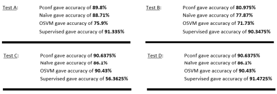
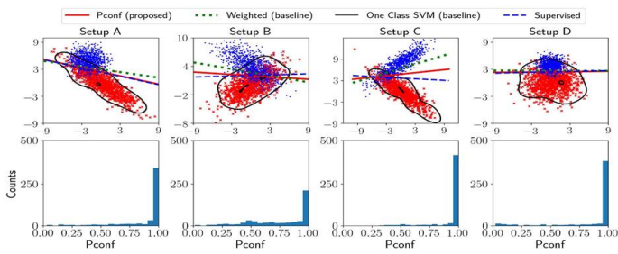

# Positive-Confidence-classifier-for-phishing-website-detection

In Data Science, we are generally taught to use positive as well as negative datasets to train the model. But we have reproduced this research paper in which only positive datapoints are provided to the classified and confidence level variable is assigned to each datapoints, which are then use for classification.

# Pconf Test Cases

## Results of Pconf test on Random Generated 1-D DataSet

## Results of Pconf test on Spaceship Titanic Dataset

## Results of Pconf test on to detect Phishing Website Dataset

# Requirements
Python 3.6 numpy 1.13 Pytorch 0.4 matplotlib 2.1.1
